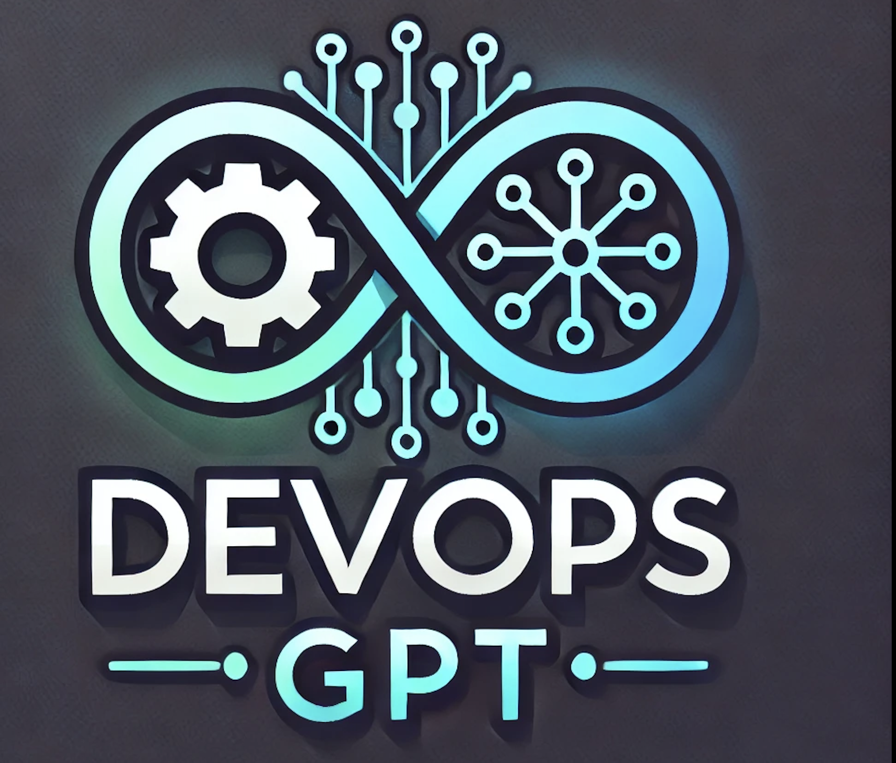
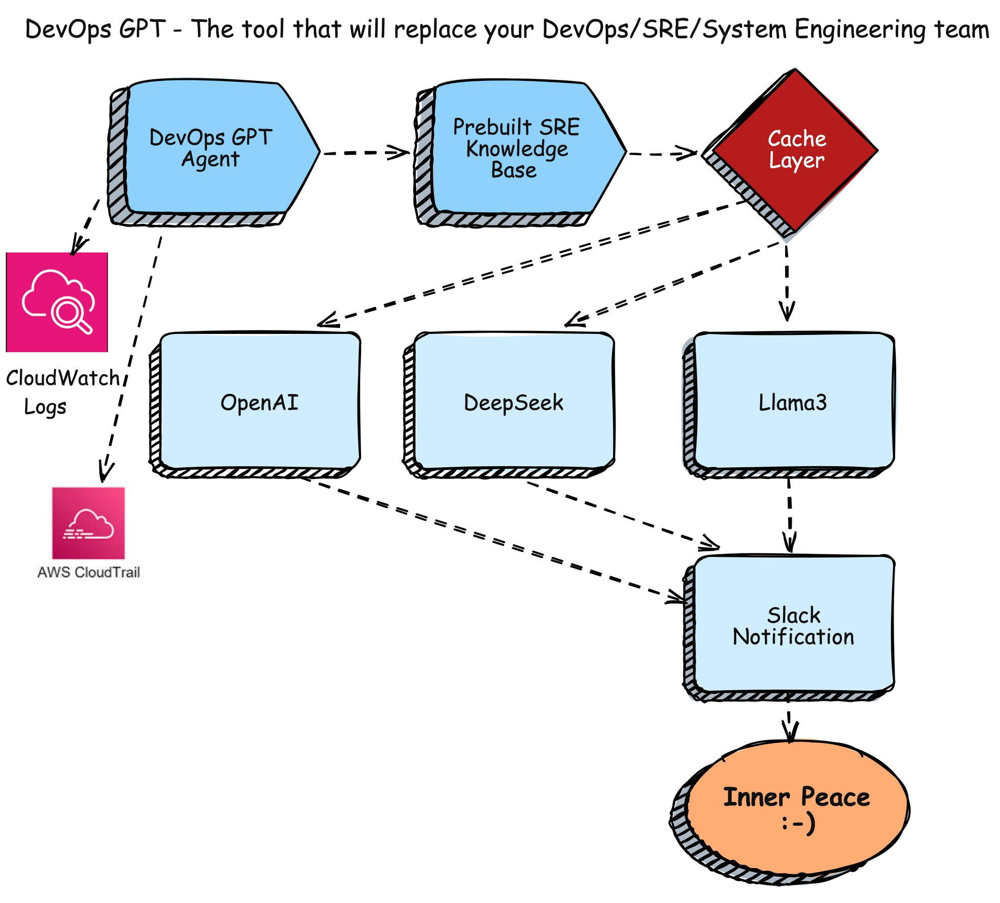

# DevOps-GPT Agent 🚀  
**Automating SRE Resolutions with AI-Powered Insights**

[](LICENSE)  
[](https://slack.com)

## Architecture


## Overview  
DevOps-GPT Agent is an innovative server-side solution to streamline DevOps/System Engineer/Site Reliability Engineering (SRE) workflows. Integrating AI, caching, and Slack notifications provides rapid resolutions to errors and incidents, leveraging existing knowledge and cutting-edge Large Language Models (LLMs). DevOps-GPT Agent is now even more powerful with AWS CloudWatch and CloudTrail support!.  

## How It Works  
1. **Knowledge Base Lookup**: The agent first checks the existing SRE knowledge base to identify if the error is already documented.  
2. **Cache Layer Validation**: If the error isn't found in the knowledge base, the agent queries the cache layer to determine if the resolution has been processed recently.  
3. **AI Query via LLM**: If the error is not present in both the knowledge base and cache, the agent contacts the LLM of your choice, such as OpenAI's GPT models, LLama3 or DeepSeek, to generate a resolution.  
4. **Resolution Delivery**: The final resolution is sent to a configured Slack channel, ensuring real-time updates and collaboration.  

## Features  
- 🔍 **SRE Knowledge Integration**: Save time by reusing existing resolutions.  
- ⚡ **Cache Layer Optimization**: Reduce redundant queries and improve performance.  
- 🤖 **AI-Powered Assistance**: Get precise solutions from OpenAI GPT or Ollama models.  
- 📩 **Slack Notifications**: Keep your team informed with automated updates.
- ☁️ CloudWatch Integration: Seamlessly read from centralized logs for faster, more efficient troubleshooting.
- ☁️ CloudTrail-Integration: Automatically analyze AWS API activity logs for security, auditing, and compliance.

## YouTube Video
[](https://youtu.be/X7MXKN5L9-0?si=4N2wCgME7qqMYjew)


## Installation  

### Step 1: Install the RPM Package  
Run the following command in RedHat to install DevOps-GPT Agent:  
```bash
rpm -ivh https://github.com/thedevops-gpt/devops-gpt/releases/download/0.0.3/devops-gpt-0.0.3-0.el9.x86_64.rpm
```
Note: If you encounter dependency issues, resolve them with:

```bash
yum -y install python3-pip
```


### Step 2: Configure the Agent
Run the configuration command and follow the prompts:

```bash
#OpenAI
sudo devops-gpt-configure
Enter check interval in seconds [10]: 
Enter batch size [1]: 
Enter maximum errors per batch [10]: 
Enter error window in seconds [3600]: 

Available LLM providers:
1. OpenAI (requires API key)
2. Ollama (local)
Choose LLM provider (1/2) [1]: 
Enter OpenAI API key: sk-XXXXX
Enable Slack notifications? (y/n) [y]: 
Enter Slack webhook URL: https://hooks.slack.com/services/XXXXXXXXX
Enable CloudWatch logs monitoring? (y/n) [n]: y
Enter AWS credentials for CloudWatch access:
AWS Access Key ID: AKXXXXX
AWS Secret Access Key: TKXXXXXXXXXXX
AWS Region (e.g., us-east-1): us-west-2
CloudWatch Log Group Name: my-cloudwatch-log-group
Enter CloudTrail Trail Name: my-demo-trail
Configuration saved to /etc/devops-gpt/config.yaml
```
**Note**: Using OpenAI's API incurs costs based on the number of API calls you make.

```bash
# Ollama(DeepSeek or Llama3
sudo devops-gpt-configure 
Enter check interval in seconds [10]: 
Enter batch size [1]: 
Enter maximum errors per batch [10]: 
Enter error window in seconds [3600]: 

Available LLM providers:
1. OpenAI (requires API key)
2. Ollama (local)
Choose LLM provider (1/2) [1]: 2

Available Ollama models:
1. Llama 3.3
2. DeepSeek
Choose Ollama model (1/2) [1]: 2
Enable Slack notifications? (y/n) [y]: 
Enter Slack webhook URL: https://hooks.slack.com/services/XXXXXX
Enable CloudWatch logs monitoring? (y/n) [n]: y
Enter AWS credentials for CloudWatch access:
AWS Access Key ID: AKXXXXX
AWS Secret Access Key: TKXXXXXXXXXXX
AWS Region (e.g., us-east-1): us-west-2
CloudWatch Log Group Name: my-cloudwatch-log-group
Enter CloudTrail Trail Name: my-demo-trail
Configuration saved to /etc/devops-gpt/config.yaml
```

Configuration Prompts:

- Enter check interval in seconds [10]: Set the interval between checks (default: 10 seconds).
- Enter batch size [1]: Define the number of errors to process in a batch (default: 1).
- Enter maximum errors per batch [10]: Set the maximum number of errors in a batch (default: 10).
- Enter error window in seconds [3600]: Specify the time window for error tracking (default: 1 hour).

Choose LLM provider:
1. OpenAI (requires API key)
2. Ollama (local LLM)
3. DeepSeek (local LLM)

- Enter OpenAI API key: Provide your OpenAI API key (https://platform.openai.com/api-keys).
- Enable Slack notifications? (y/n): Enable or disable Slack notifications.
- Enter Slack webhook URL: Add your Slack Webhook URL (https://api.slack.com/messaging/webhooks).
- The configuration is saved to /etc/devops-gpt/config.yaml.
- Ollama Linux Installation (https://github.com/ollama/ollama/blob/main/docs/linux.md)

### Step 3: Start and Enable the Service
Start the DevOps-GPT Agent service:
```bash
sudo systemctl start devops-gpt
sudo systemctl enable devops-gpt
```

### Step 4: You can test it using tools like a logger.
```bash
logger -p user.err "Out of Memory (OOM) error: Process killed due to insufficient memory"
```

## Output
```bash
sudo journalctl -u devops-gpt -f
Feb 01 20:16:20plakhera.devops-gpt.com[6617]: 2025-02-01 20:16:20,463 - devops_gpt.error_patterns - INFO - DevOps GPT Error Analyzer initialized with 20 patterns
Feb 01 20:16:20plakhera.devops-gpt.com[6617]: 2025-02-01 20:16:20,463 - __main__ - INFO - DevOps GPT initialized with OLLAMA as LLM provider
Feb 01 20:16:50plakhera.devops-gpt.com[6617]: 2025-02-01 20:16:50,523 - devops_gpt.log_monitor - INFO - Found 2 new unique errors
Feb 01 20:16:50plakhera.devops-gpt.com[6617]: 2025-02-01 20:16:50,523 - __main__ - INFO - Found 2 new errors
Feb 01 20:16:50plakhera.devops-gpt.com[6617]: 2025-02-01 20:16:50,524 - __main__ - INFO - Processing batch of 2 errors
Feb 01 20:16:50plakhera.devops-gpt.com[6617]: 2025-02-01 20:16:50,524 - __main__ - INFO - Attempting to match errors with known patterns...
Feb 01 20:16:50plakhera.devops-gpt.com[6617]: 2025-02-01 20:16:50,524 - __main__ - INFO - No matching patterns found in local database. Contacting OLLAMA for analysis...
Feb 01 20:16:50plakhera.devops-gpt.com[6617]: 2025-02-01 20:16:50,524 - devops_gpt.llms.ollama_provider - WARNING - Running on CPU - this may take several minutes...
Feb 01 20:16:50plakhera.devops-gpt.com[6617]: 2025-02-01 20:16:50,525 - devops_gpt.llms.ollama_provider - INFO - Still processing... (0 seconds elapsed)
Feb 01 20:16:50plakhera.devops-gpt.com[6617]: 2025-02-01 20:16:50,525 - devops_gpt.llms.ollama_provider - INFO - Sending request to Ollama API (this may take 10-15 minutes on CPU)...
Feb 01 20:17:20plakhera.devops-gpt.com[6617]: 2025-02-01 20:17:20,555 - devops_gpt.llms.ollama_provider - INFO - Still processing... (30 seconds elapsed)
Feb 01 20:17:50plakhera.devops-gpt.com[6617]: 2025-02-01 20:17:50,585 - devops_gpt.llms.ollama_provider - INFO - Still processing... (60 seconds elapsed)
Feb 01 20:18:04plakhera.devops-gpt.com[6617]: 2025-02-01 20:18:04,265 - devops_gpt.llms.ollama_provider - INFO - Ollama response received in 73.7 seconds
Feb 01 20:18:04plakhera.devops-gpt.com[6617]: 2025-02-01 20:18:04,267 - devops_gpt.llms.ollama_provider - INFO - Successfully received analysis from Ollama
Feb 01 20:18:04plakhera.devops-gpt.com[6617]: 2025-02-01 20:18:04,267 - __main__ - INFO - Sending analysis to Slack...
Feb 01 20:18:04plakhera.devops-gpt.com[6617]: 2025-02-01 20:18:04,373 - __main__ - INFO - Successfully sent message to Slack
```

## Example Workflow

1. Incident Detected: An application encounters an unexpected error locally or from CloudWatch logs
2. Resolution Process: The agent checks the SRE knowledge base and cache.
3. If a resolution exists: Fetch it immediately.
4. If not: Query the configured LLM to generate a solution.
5. Notification Sent: The generated resolution is posted to the Slack channel.
