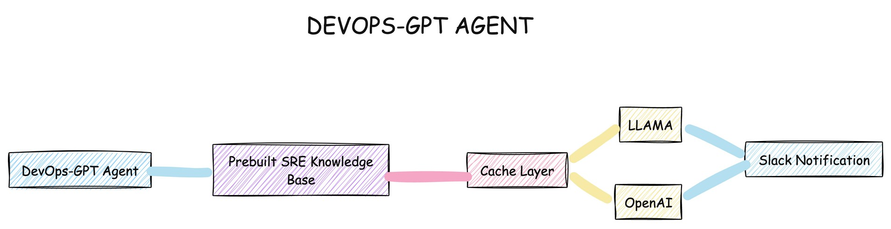

# DevOps-GPT Agent 🚀  
**Automating SRE Resolutions with AI-Powered Insights**

[](LICENSE)  
[](https://slack.com)


## Architecture


## Overview  
DevOps-GPT Agent is an innovative server-side solution to streamline DevOps/Site Reliability Engineering (SRE) workflows. Integrating AI, caching, and Slack notifications provides rapid resolutions to errors and incidents, leveraging existing knowledge and cutting-edge Large Language Models (LLMs).  

## How It Works  
1. **Knowledge Base Lookup**: The agent first checks the existing SRE knowledge base to identify if the error is already documented.  
2. **Cache Layer Validation**: If the error isn't found in the knowledge base, the agent queries the cache layer to determine if the resolution has been processed recently.  
3. **AI Query via LLM**: If the error is not present in both the knowledge base and cache, the agent contacts the LLM of your choice, such as OpenAI's GPT models or Ollama's local LLM, to generate a resolution.  
4. **Resolution Delivery**: The final resolution is sent to a configured Slack channel, ensuring real-time updates and collaboration.  

## Features  
- 🔍 **SRE Knowledge Integration**: Save time by reusing existing resolutions.  
- ⚡ **Cache Layer Optimization**: Reduce redundant queries and improve performance.  
- 🤖 **AI-Powered Assistance**: Get precise solutions from OpenAI GPT or Ollama models.  
- 📩 **Slack Notifications**: Keep your team informed with automated updates.  

## Installation  

### Step 1: Install the RPM Package  
Run the following command to install DevOps-GPT Agent:  
```bash
rpm -ivh https://github.com/thedevops-gpt/devops-gpt/blob/main/devops-gpt-0.0.1.x86_64.rpm
```
Note: If you encounter dependency issues, resolve them with:

```bash
yum -y install python3-pip
```

### Step 2: Configure the Agent
Run the configuration command and follow the prompts:

```bash
sudo devops-gpt-configure
```
Configuration Prompts:

- Enter check interval in seconds [10]: Set the interval between checks (default: 10 seconds).
- Enter batch size [1]: Define the number of errors to process in a batch (default: 1).
- Enter maximum errors per batch [10]: Set the maximum number of errors in a batch (default: 10).
- Enter error window in seconds [3600]: Specify the time window for error tracking (default: 1 hour).

Choose LLM provider:
1. OpenAI (requires API key)
2. Ollama (local LLM)

- Enter OpenAI API key: Provide your OpenAI API key (Get your key here).
- Enable Slack notifications? (y/n): Enable or disable Slack notifications.
- Enter Slack webhook URL: Add your Slack Webhook URL (Learn more about Slack Webhooks).
- The configuration is saved to /etc/devops-gpt/config.yaml.

### Step 3: Start and Enable the Service
Start the DevOps-GPT Agent service:
```bash
sudo systemctl start devops-gpt
sudo systemctl enable devops-gpt
```

## Example Workflow

1. Incident Detected: An application encounters an unexpected error.
2. Resolution Process: The agent checks the SRE knowledge base and cache.
3. If a resolution exists: Fetch it immediately.
4. If not: Query the configured LLM to generate a solution.
5. Notification Sent: The generated resolution is posted to the Slack channel.
